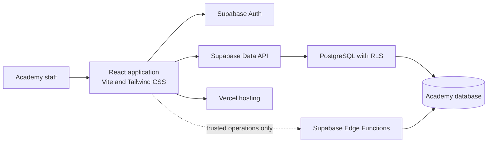

# Academy Management System Architecture

## 1. Purpose

This document proposes a simple implementation architecture for the requirements in [PRD.md](PRD.md). It uses React, Tailwind CSS, and Vite for the frontend; Supabase for authentication and backend services; and Vercel for frontend deployment. It is a design proposal, not an implementation specification for every library or configuration choice.

## 2. Architecture Overview

Use a single-page web application backed by Supabase. The browser communicates with Supabase using the Supabase JavaScript client. PostgreSQL constraints and Row Level Security (RLS) enforce data integrity and access rules. A separate application server is not required for the MVP.



The dotted Edge Function path is optional. Add server-side functions only for operations that must not be performed with the user's public client credentials, such as privileged staff invitations or future third-party integrations.

## 3. Technology Choices

| Area | Proposal | Responsibility |
|---|---|---|
| Frontend | React, TypeScript, Vite | User interface, navigation, and client-side interaction |
| Styling | Tailwind CSS | Consistent responsive styling and accessible visual states |
| Routing | React Router | Feature pages and authenticated navigation |
| Backend | Supabase | PostgreSQL, authentication, generated data APIs, and optional Edge Functions |
| Hosting | Vercel | Build and deploy the Vite frontend, including preview deployments |
| Validation | Zod, optionally with React Hook Form | Reusable form validation and user-facing errors |
| Data fetching | Supabase client; optionally TanStack Query | Queries, mutations, cache invalidation, and loading/error states |
| Testing | Vitest and React Testing Library; database/RLS tests | Unit, component, and access-policy verification |

Keep the dependency set small at the start. TanStack Query is useful when caching and invalidation become non-trivial, but it is not a prerequisite for the first screen.

## 4. Frontend Organization

Organize code around product features, with shared UI and infrastructure separated from feature-specific behavior. Adapt file names to the chosen libraries and keep domain rules close to the feature that owns them.

```text
src/
  app/                 # Application entry, routes, layouts, session state
  shared/              # Reusable UI, form components, validation helpers
  lib/                 # Supabase client and common integrations
  modules/
    students/
    teachers/
    courses/
    attendance/
    fees/
    dashboard/
```

Each feature can contain its pages, components, queries/mutations, and local types. Avoid creating empty abstractions or separating the frontend into multiple deployable applications for the MVP.

### Suggested navigation

- Dashboard
- Students
- Teachers
- Courses
- Attendance
- Fees
- Staff settings (administrator only)

Use route guards to provide a clear user experience, but never rely on route guards to secure data. Authorization is enforced by Supabase policies and, where applicable, trusted server-side functions.

## 5. Supabase Data Model

Use UUID primary keys, foreign keys, unique constraints, check constraints, and timestamps as appropriate. The initial logical tables are:

| Table | Purpose |
|---|---|
| `staff_profiles` | Staff profile linked to a Supabase Auth user, with role and active status |
| `students` | Student identifier, contact details, enrollment date, and active/withdrawn status |
| `teachers` | Teacher details and status; optionally linked to a staff profile if the teacher signs in |
| `courses` | Course identifier, name, description, and status |
| `course_teachers` | Many-to-many assignment of teachers to courses |
| `enrollments` | Student enrollment in a course, including enrollment status and relevant dates |
| `attendance_sessions` | Course and date/time representing a class session |
| `attendance_entries` | Per-student present, absent, or late status for a session |
| `fee_obligations` | Amount due, due date, currency, and related student/enrollment |
| `payments` | Payment amount, date, method, reference, and audit fields |
| `payment_allocations` | Optional link of a payment to one or more fee obligations, if partial/multi-obligation payments are needed |

Avoid storing a separately editable balance. Calculate balances from obligations, valid payments, and adjustments. If performance later requires cached summaries, make them derived and update them transactionally so they cannot silently diverge from the ledger.

### Integrity rules to enforce in the database

- Student and course identifiers are unique within the academy.
- A student has at most one active enrollment in a given course at a time.
- An attendance entry is unique for a student within an attendance session.
- Attendance status is limited to the allowed values.
- Payment amounts are positive and use fixed-precision decimal storage.
- Historical attendance and payment records are retained when a student, teacher, or course is deactivated or archived.
- Foreign keys and appropriate delete restrictions preserve the history needed for audit and reporting.

The PRD leaves academic terms, course session scheduling, and the exact fee model open. Confirm those before finalizing enrollment, session, and fee table details.

## 6. Authentication and Authorization

Use Supabase Auth for staff sign-in. A `staff_profiles` row references the corresponding `auth.users` identity and provides the application role, such as `administrator`, `teacher`, or `finance`.

- Enable RLS on every table containing academy data.
- Write policies around the minimum access each role needs. Teachers should only see assigned courses and their related student/attendance data; finance staff should access fee and payment workflows without user administration; administrators manage academy data.
- Ensure authorization checks use trusted database identity and role data. Do not trust role values supplied by the browser.
- Keep the Supabase public/publishable key in the frontend only with RLS correctly configured. Never put a Supabase service-role key in Vite variables or browser code.
- Deactivate accounts through an administrative workflow. Preserve historical actor identifiers so past changes remain attributable.

RLS policies are part of the security boundary and must be tested directly, including attempts to read and mutate records outside a user's role or assigned courses.

## 7. Important Data Flows

### Attendance

1. A signed-in teacher loads only courses assigned to them.
2. The teacher selects a course and session date/time.
3. The app loads the active roster and collects attendance statuses.
4. The app saves the session and entries; database constraints prevent duplicate student entries.
5. The database records the actor and timestamps; authorized staff can later review or correct entries.

### Fees and payments

1. Finance staff loads a student's fee obligations and payment history.
2. The app displays the calculated outstanding amount.
3. Finance staff enters a payment and confirms its date, method, and optional reference.
4. The write is validated and recorded with an actor; corrections use a documented reversal/adjustment rather than silently deleting history.
5. The app refreshes the student's balance and related dashboard summaries.

For multi-record operations, use a database transaction or a narrowly scoped database function so partial writes cannot leave inconsistent records.

## 8. Deployment and Environments

- Vercel builds and serves the Vite frontend.
- Supabase provides the hosted database, Auth, and generated data APIs.
- Create separate Supabase projects for development and production. Do not use production student or payment data in local development or preview deployments.
- Configure environment variables separately for local, preview, and production environments. Frontend variables may contain the Supabase project URL and public/publishable key, but never secrets.
- Configure Supabase Auth redirect and password recovery URLs for local development and the production domain; review preview-domain behavior before enabling preview sign-in.
- Keep database schema and policy changes as versioned migrations. Apply and review migrations in development before production.
- Set up database backups and test restoring them before entering real academy data.

## 9. Quality and Operations

- Unit-test fee calculations, validation, and other business rules.
- Component-test important forms and role-dependent UI behavior.
- Test database constraints and RLS policies against each role, including denied operations.
- Add end-to-end tests for administrator setup, attendance entry, and payment recording as those workflows are implemented.
- Configure continuous integration to install dependencies, run tests, and produce a production build.
- Provide clear loading, empty, success, and error states; prevent double submission for payment and attendance writes.
- Use accessible labels, keyboard navigation, visible focus indicators, and responsive layouts.
- Before launch, define who handles staff account recovery, production access, backups, and privacy/data-retention requests.

## 10. Decisions to Confirm Before Implementation

1. Is the academy strictly single-branch, or should records be scoped to branches from the beginning?
2. Are courses organized into terms/semesters, and can the same course run more than once?
3. Are attendance sessions date-only or scheduled with start times and time zones?
4. Are fees one-time, recurring, installment-based, or a combination? Can one payment cover multiple fees?
5. What currency, time zone, student/teacher identifiers, and required personal data will be used?
6. Which staff roles may create, correct, reverse, or export payment and attendance records?
7. Who can invite staff accounts, and what is the account recovery process?
8. What are the data retention, backup frequency, and recovery expectations?

These choices affect the database model and RLS policies, so resolve them before loading real data. The MVP should otherwise remain a single application and a single Supabase project per environment; add services only when a concrete requirement justifies them.