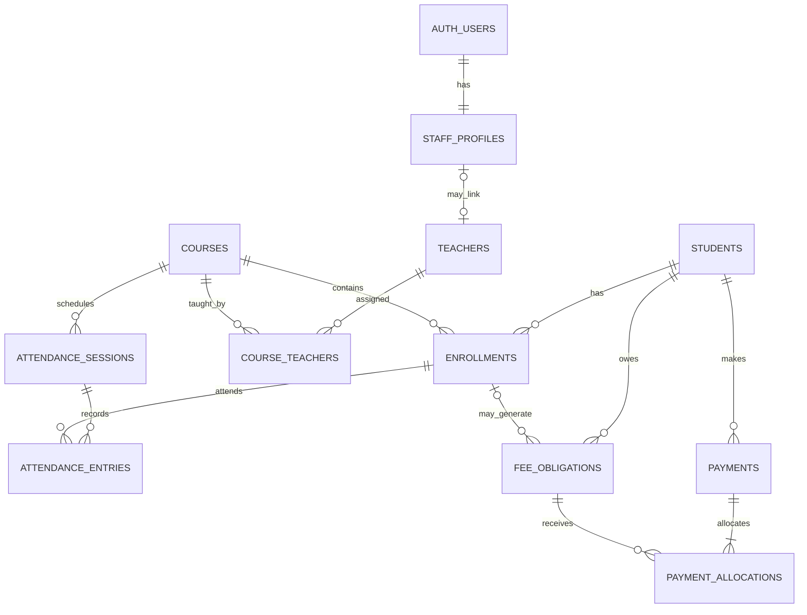

# Academy Management System Database Design

## 1. Purpose

This document proposes the initial PostgreSQL schema for the requirements in [PRD.md](PRD.md), using Supabase as the database and authentication provider. It complements [ARCHITECTURE.md](ARCHITECTURE.md). It is a design document only; no migrations or application code are included.

## 2. Design Decisions and Assumptions

- **Single academy for MVP:** records are not scoped by `academy_id`. If multiple branches or independent academies become a requirement, add that scope before production data is entered.
- **UUID primary keys:** use `uuid` identifiers, generated by PostgreSQL. Human-readable student, teacher, and course codes are separate unique fields.
- **Authentication:** Supabase Auth owns credentials. Application staff data is stored in `staff_profiles`, keyed by the Auth user ID.
- **No academic terms in the first schema:** enrollments and attendance are tied directly to courses. Add an offering/term layer if a course can run repeatedly as distinct cohorts.
- **Attendance sessions have a start timestamp:** store `timestamptz` and use the academy time zone for display and date-based reports. Confirm whether multiple sessions per course per day are needed.
- **Fees are obligations:** a fee is recorded per student and may optionally link to an enrollment. Payments are allocated to obligations so due and overdue balances can be calculated.
- **No silent deletion of financial history:** payments are reversed or adjusted through auditable records. The initial design blocks allocations above an obligation's remaining balance; representing overpayment as student credit requires an additional credit-ledger decision.
- **One configured currency:** all fee obligations in the MVP use the academy currency. Do not mix currencies in one balance.

## 3. Entity Relationships



`AUTH_USERS` is managed by Supabase and is shown here to explain the identity relationship; it is not an application-owned table to create or modify directly.

## 4. Conventions

- Use `uuid` primary keys with `gen_random_uuid()` defaults unless a row's natural composite key is more appropriate.
- Use `timestamptz` for event/audit timestamps and `date` for calendar-only values such as a due date or payment date.
- Use `numeric(12, 2)` for MVP monetary amounts; confirm the required precision and currency rules before real financial data is entered.
- Use `text` columns with `CHECK` constraints for small status/method sets in the first version. This keeps schema changes straightforward while the product is new.
- Include `created_at timestamptz not null default now()` and `created_by uuid references staff_profiles(user_id)` on records where attribution is required. Add `updated_at` and `updated_by` to editable records.
- Use `ON DELETE RESTRICT` (or equivalent) for relationships that preserve operational history. Deactivate or archive records rather than deleting them.
- Store contact details only when needed for academy operations. Apply stricter access to personal and financial data than to general course data.

## 5. Table Design

### 5.1 `academy_settings`

One configuration row for the single-academy MVP.

| Column | Type | Rules / purpose |
|---|---|---|
| `id` | `smallint` | Primary key; check constraint requires `id = 1` |
| `academy_name` | `text` | Required |
| `currency_code` | `char(3)` | Required ISO 4217 code; one currency for MVP |
| `time_zone` | `text` | Required IANA time zone, such as `America/New_York` |
| `updated_at` | `timestamptz` | Required; updated on change |
| `updated_by` | `uuid` | Staff profile that made the change |

### 5.2 `staff_profiles`

Application role and display information for a Supabase Auth user.

| Column | Type | Rules / purpose |
|---|---|---|
| `user_id` | `uuid` | Primary key and foreign key to `auth.users.id`; cascade behavior must not erase audit history |
| `full_name` | `text` | Required |
| `role` | `text` | Required; check: `administrator`, `teacher`, or `finance` |
| `is_active` | `boolean` | Required; default `true`; inactive profiles cannot use the application |
| `created_at` | `timestamptz` | Required |
| `updated_at` | `timestamptz` | Required |

Create or deactivate Auth accounts through a trusted administrative workflow. Do not expose the Supabase service-role key to the browser. A profile role is authoritative only when read and enforced by trusted database policies, never when supplied by the client.

### 5.3 `students`

| Column | Type | Rules / purpose |
|---|---|---|
| `id` | `uuid` | Primary key |
| `student_number` | `text` | Required; unique, trimmed, and case-normalized by the application or database |
| `full_name` | `text` | Required |
| `email` | `text` | Optional |
| `phone` | `text` | Optional |
| `enrolled_on` | `date` | Required |
| `status` | `text` | Required; check: `active`, `withdrawn`, `inactive` |
| `created_at`, `updated_at` | `timestamptz` | Required |
| `created_by`, `updated_by` | `uuid` | References `staff_profiles.user_id` |

Do not use email as the primary identifier. A student does not have an Auth account in the MVP.

### 5.4 `teachers`

| Column | Type | Rules / purpose |
|---|---|---|
| `id` | `uuid` | Primary key |
| `teacher_number` | `text` | Required and unique |
| `profile_user_id` | `uuid` | Optional unique reference to `staff_profiles.user_id`; set when this teacher signs in |
| `full_name` | `text` | Required |
| `email` | `text` | Optional |
| `phone` | `text` | Optional |
| `status` | `text` | Required; check: `active`, `inactive` |
| `created_at`, `updated_at` | `timestamptz` | Required |
| `created_by`, `updated_by` | `uuid` | References `staff_profiles.user_id` |

The optional profile link allows a teacher record to exist before an account is created. A staff profile has one role in this MVP; if users must hold multiple roles, replace the single role column with a role-assignment table.

### 5.5 `courses`

| Column | Type | Rules / purpose |
|---|---|---|
| `id` | `uuid` | Primary key |
| `course_code` | `text` | Required and unique |
| `name` | `text` | Required |
| `description` | `text` | Optional |
| `default_fee_amount` | `numeric(12, 2)` | Optional, non-negative; default used to suggest an enrollment obligation, not a live balance |
| `status` | `text` | Required; check: `draft`, `active`, `archived` |
| `created_at`, `updated_at` | `timestamptz` | Required |
| `created_by`, `updated_by` | `uuid` | References `staff_profiles.user_id` |

Changing a course's default fee must not silently change fee obligations already assigned to students.

### 5.6 `course_teachers`

Join table for teacher assignments.

| Column | Type | Rules / purpose |
|---|---|---|
| `course_id` | `uuid` | Required foreign key to `courses.id` |
| `teacher_id` | `uuid` | Required foreign key to `teachers.id` |
| `is_active` | `boolean` | Required; default `true` |
| `assigned_at` | `timestamptz` | Required |
| `assigned_by` | `uuid` | References `staff_profiles.user_id` |

Use a composite primary key `(course_id, teacher_id)` and retain inactive assignments for historical reference. If teachers may be removed and later reassigned while preserving each assignment period, replace this key with a UUID and assignment start/end timestamps.

### 5.7 `enrollments`

| Column | Type | Rules / purpose |
|---|---|---|
| `id` | `uuid` | Primary key |
| `student_id` | `uuid` | Required foreign key to `students.id` |
| `course_id` | `uuid` | Required foreign key to `courses.id` |
| `status` | `text` | Required; check: `active`, `withdrawn`, `completed` |
| `enrolled_on` | `date` | Required |
| `ended_on` | `date` | Optional; must be on or after `enrolled_on` when set |
| `created_at`, `updated_at` | `timestamptz` | Required |
| `created_by`, `updated_by` | `uuid` | References `staff_profiles.user_id` |

Create a partial unique index on `(student_id, course_id)` for rows where `status = 'active'`, allowing a student to withdraw and later re-enroll while preventing duplicate active enrollments.

### 5.8 `attendance_sessions`

| Column | Type | Rules / purpose |
|---|---|---|
| `id` | `uuid` | Primary key |
| `course_id` | `uuid` | Required foreign key to `courses.id` |
| `starts_at` | `timestamptz` | Required; interpreted/displayed in academy time zone |
| `ends_at` | `timestamptz` | Optional; if present, must be after `starts_at` |
| `notes` | `text` | Optional |
| `created_at`, `updated_at` | `timestamptz` | Required |
| `created_by`, `updated_by` | `uuid` | References `staff_profiles.user_id` |

Add a unique constraint on `(course_id, starts_at)` to prevent duplicate sessions. If the academy allows two sessions for a course to start at the same timestamp, introduce a separate session identifier or scheduling rule instead.

### 5.9 `attendance_entries`

| Column | Type | Rules / purpose |
|---|---|---|
| `id` | `uuid` | Primary key |
| `session_id` | `uuid` | Required foreign key to `attendance_sessions.id` |
| `enrollment_id` | `uuid` | Required foreign key to `enrollments.id` |
| `status` | `text` | Required; check: `present`, `absent`, `late` |
| `note` | `text` | Optional; avoid sensitive health details |
| `created_at`, `updated_at` | `timestamptz` | Required |
| `created_by`, `updated_by` | `uuid` | References `staff_profiles.user_id` |

Add a unique constraint on `(session_id, enrollment_id)`. Validate that the enrollment's course matches the session's course and that the student was eligible for the session. Because those fields live on related rows, enforce this in a transaction/function or database trigger, not only in the UI.

### 5.10 `fee_obligations`

| Column | Type | Rules / purpose |
|---|---|---|
| `id` | `uuid` | Primary key |
| `student_id` | `uuid` | Required foreign key to `students.id` |
| `enrollment_id` | `uuid` | Optional foreign key to `enrollments.id`; when set, it must belong to `student_id` |
| `description` | `text` | Required, such as course fee or registration fee |
| `amount` | `numeric(12, 2)` | Required and greater than zero |
| `due_on` | `date` | Optional |
| `status` | `text` | Required; check: `open`, `void` |
| `created_at`, `updated_at` | `timestamptz` | Required |
| `created_by`, `updated_by` | `uuid` | References `staff_profiles.user_id` |

Use `academy_settings.currency_code` for all obligations in this single-currency MVP. An obligation's original amount is immutable after payments are allocated; correct it using a documented adjustment or void-and-recreate workflow.

### 5.11 `payments`

| Column | Type | Rules / purpose |
|---|---|---|
| `id` | `uuid` | Primary key |
| `student_id` | `uuid` | Required foreign key to `students.id` |
| `amount` | `numeric(12, 2)` | Required and greater than zero |
| `paid_on` | `date` | Required |
| `method` | `text` | Required; initial values may include `cash`, `bank_transfer`, `card`, `other` |
| `reference` | `text` | Optional receipt or transaction reference |
| `note` | `text` | Optional |
| `status` | `text` | Required; check: `posted`, `reversed` |
| `reversed_at` | `timestamptz` | Set when reversed |
| `reversed_by` | `uuid` | Staff member who reversed it |
| `reversal_reason` | `text` | Required when reversed |
| `created_at` | `timestamptz` | Required |
| `created_by` | `uuid` | Required reference to `staff_profiles.user_id` |

Posted payment financial fields must not be edited in place. Reversal is an explicit state change with actor, time, and reason. Enforce the transition through a database function or restricted update policy.

### 5.12 `payment_allocations`

Associates a payment with one or more obligations.

| Column | Type | Rules / purpose |
|---|---|---|
| `id` | `uuid` | Primary key |
| `payment_id` | `uuid` | Required foreign key to `payments.id` |
| `fee_obligation_id` | `uuid` | Required foreign key to `fee_obligations.id` |
| `amount` | `numeric(12, 2)` | Required and greater than zero |
| `created_at` | `timestamptz` | Required |

An allocation must connect a payment and obligation for the same student. The sum of allocations cannot exceed the payment amount or the obligation's remaining balance. These are cross-row rules and require a transactional database function/trigger with concurrency protection; a simple `CHECK` constraint cannot enforce them. Reversing a payment must exclude its allocations from paid totals without deleting allocation history.

### 5.13 `audit_events`

Append-only audit trail for sensitive attendance and financial changes.

| Column | Type | Rules / purpose |
|---|---|---|
| `id` | `bigint generated always as identity` | Primary key |
| `entity_type` | `text` | Required; allow-listed table/domain name |
| `entity_id` | `uuid` | Required ID of the affected record |
| `action` | `text` | Required; for example `created`, `updated`, `reversed` |
| `actor_user_id` | `uuid` | References staff identity; retain attribution if the account is deactivated |
| `occurred_at` | `timestamptz` | Required, set by the database |
| `change_summary` | `jsonb` | Optional before/after fields; redact credentials and unnecessary personal data |

Write audit events through database triggers or narrowly scoped functions so clients cannot fabricate or edit audit history. Restrict audit reads to administrators and avoid duplicating sensitive values unnecessarily.

## 6. Derived Values and Reporting

Do not store a mutable `balance` column. Calculate an obligation balance as:

```text
obligation amount
- allocations from posted payments
= remaining obligation balance
```

Student outstanding balance is the sum of remaining open obligations. An obligation is overdue when it is open, has a due date before the academy's current date, and has a positive remaining balance. A reversed payment contributes zero to paid totals.

Expose dashboard summaries through RLS-safe queries or views configured to respect caller permissions. Do not assume a normal database view automatically applies the caller's intended authorization; verify view ownership and security-invoker behavior. Add a materialized or cached summary only after measuring a real performance need, with a defined refresh/consistency strategy.

## 7. Indexes

In addition to primary-key and unique indexes, add indexes for common joins, filters, and RLS checks:

- `students(status, full_name)` and normalized `student_number` lookup.
- `teachers(status, full_name)` and `teacher_number` lookup.
- `courses(status, name)` and `course_code` lookup.
- `course_teachers(teacher_id, is_active)` for teacher course access.
- `enrollments(course_id, status)` and `enrollments(student_id, status)`; include the partial unique active-enrollment index.
- `attendance_sessions(course_id, starts_at DESC)`.
- `attendance_entries(enrollment_id, session_id)` and unique `(session_id, enrollment_id)`.
- `fee_obligations(student_id, status, due_on)` and `fee_obligations(enrollment_id)`.
- `payments(student_id, paid_on DESC, status)`.
- `payment_allocations(fee_obligation_id)` and `payment_allocations(payment_id)`.
- `audit_events(entity_type, entity_id, occurred_at DESC)`.

For name search, begin with case-insensitive matching and add PostgreSQL trigram/full-text indexes only if search performance or quality requires them.

## 8. Access Policy Matrix

The matrix is policy intent, not a substitute for implementing and testing RLS. All access requires an authenticated, active staff profile.

| Data | Administrator | Teacher | Finance |
|---|---|---|---|
| Staff profiles | Manage | Read own profile | Read own profile |
| Students | Create, read, update, deactivate | Read students in assigned courses | Read minimum details needed for fee work |
| Teachers and courses | Manage | Read assigned courses and relevant teachers | Read course/student references needed for fee work |
| Enrollments | Manage | Read enrollments in assigned courses | Read enrollment references needed for fee work |
| Attendance sessions/entries | Read and correct | Read and record for assigned courses; corrections per policy | No access unless separately required |
| Fee obligations | Manage | No access by default | Read and manage |
| Payments/allocations | Read and manage | No access | Read and record; reverse only with explicit permission |
| Audit events | Read | No direct access | No direct access by default |
| Academy settings | Manage | Read only if required | Read only if required |

Use `auth.uid()` to identify the caller and look up their active role in `staff_profiles`. Teacher access must be checked through active `course_teachers` assignments. Do not let a user update their own role or active status. Account creation, role changes, payment reversal, and cross-row payment allocation should use narrowly scoped trusted database functions or server-side operations with explicit authorization.

## 9. Transactional Operations

Implement these as atomic database operations, not a series of unrelated browser writes:

1. **Save attendance:** validate caller assignment, session/course consistency, enrollment eligibility, and duplicate entries; save the session and entries together.
2. **Allocate payment:** validate caller role, payment/obligation student match, positive amounts, remaining balances, and allocation sums under a transaction; write audit events.
3. **Reverse payment:** validate explicit permission and reason; mark the payment reversed and record the audit event atomically.
4. **Deactivate/withdraw:** change status while preserving related records and history.

Cross-row amount checks need transaction isolation or locking sufficient to prevent two concurrent payments from both consuming the same remaining obligation balance.

## 10. Migration and Seed Data Plan

- Store schema, indexes, functions, triggers, and RLS policies in ordered Supabase migrations.
- Apply migrations to a development Supabase project first; review and test them before production.
- Keep demo/test seed data separate from production and never commit real student or payment data.
- Test constraints, triggers, and RLS using users representing each role, including negative tests for denied access.
- Back up and test restoring the database before entering real operational data.

## 11. Decisions Required Before Schema Is Final

1. **Terms and cohorts:** Can a course run multiple times as different cohorts? If yes, add `course_offerings` (and likely `academic_terms`) between courses and enrollments/sessions.
2. **Session identity:** Can a course have multiple sessions on one day, and are start/end times required?
3. **Fee model:** Are fees one-time or recurring? Can one payment cover multiple obligations? Must overpayments become student credit, or should they be blocked?
4. **Corrections:** Who can reverse a payment or edit attendance, and what approval/audit detail is required?
5. **Branching:** Is a single academy with one location a firm MVP assumption?
6. **Data policy:** What personal data is necessary, and what retention/deletion rules apply?
7. **Currency and precision:** Confirm currency, decimal precision, and the academy's time zone.

The proposed schema intentionally keeps the first release small, but the fee-allocation and audit paths are designed to preserve trustworthy financial history. Resolve the open decisions before creating production migrations.